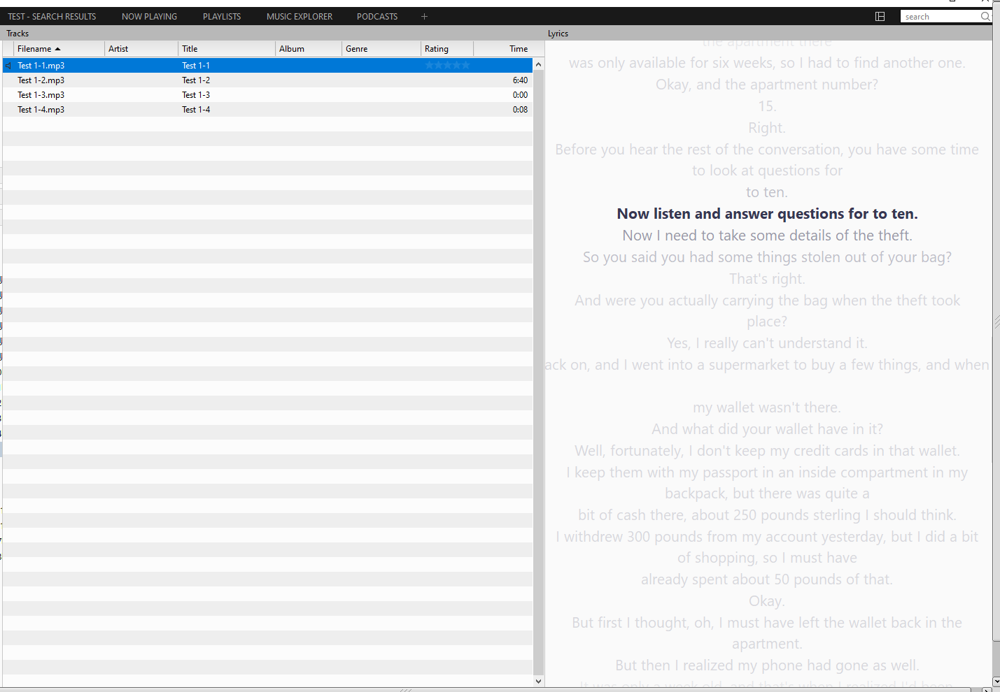
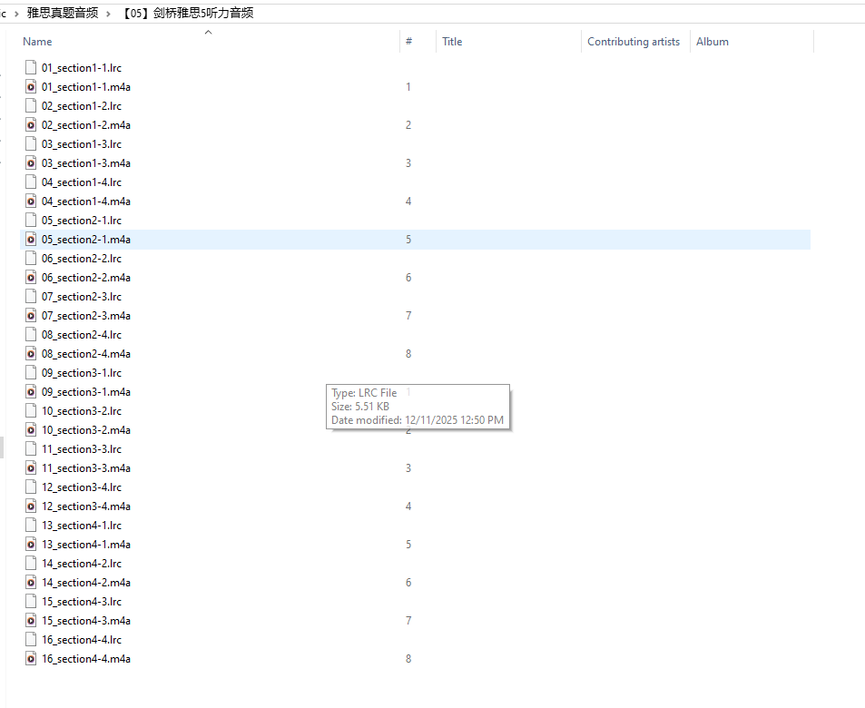
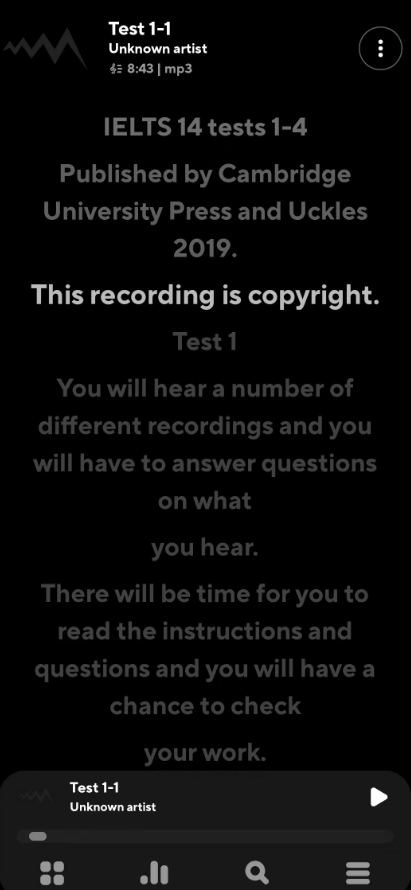

### Whisper-CPU：纯 CPU 也能快速生成精准 LRC 字幕——专为语言学习和音频转录设计的极简工具

大家好，我是 Twsa。最近在刷剑桥雅思（Cambridge IELTS）听力时，发现官方音频文件虽然标准，但缺少精确的同步字幕，尤其是填空题部分，书本脚本和实际发音总有细微差异。想一边听一边看实时字幕跟读？官方 Whisper 太依赖 GPU，CPU 跑起来像蜗牛；whisper.cpp 虽快点，但配置复杂，不够即用。

于是我基于 faster-whisper 开发了 **whisper-cpu** 这个小项目：一个**纯 CPU 优化**的工具，专攻**高速生成带时间戳的 LRC 字幕**。它让你的笔记本（无 GPU）也能在几分钟内处理 30 分钟音频，输出完美兼容 MusicBee、Poweramp 等播放器的同步字幕。简单说，**它的核心作用就是：把任何音频瞬间变“带字幕视频”，特别适合雅思/托福听力练习、播客转录或音乐歌词同步**。

项目地址：https://github.com/Twsa/whisper-cpu

#### 最明显的优点：为什么它比其他方案更香？
基于仓库的实际设计，这个项目突出在 **纯 CPU 环境下的高效与易用**，没有花里胡哨的依赖，解压即跑。以下是核心亮点（直接来自代码和 README）：

- **纯 CPU 极速优化，无需 GPU 烦恼**：默认用 `--device cpu` 和 `--compute-type int8`（8位量化），让识别速度提升数倍。结合 beam search（默认 beam-size=5），精度和速度完美平衡——tiny/base 模型下，批处理一堆音频只需几分钟。相比原生 Whisper 的 CPU 模式，它快了 4-10 倍（得益于 faster-whisper 的 CTranslate2 后端）。
  
- **一键生成标准 LRC 字幕，同步无延迟**：输出 [mm:ss.xx] 格式的时间戳文件，带元数据如 `[ar:Generated by faster-whisper]`。拖进播放器，就能边听边看——静音段自动过滤（可选 `--vad-filter`），字幕精准对齐发音。支持中英自动检测（`-l zh` 或 `en`），雅思英语音频识别率近 100%。

- **批量处理超方便，适合学习党**：递归扫描目录（`-b /path/to/dir`），一键转整个文件夹的 mp3/wav/m4a/flac/mp4。默认跳过已存在文件（用 `--force` 覆盖），模型可选 tiny（最快）到 large（最准）。安装后一行命令搞定，Windows 直接 exe 跑。

- **零门槛，模型灵活**：支持 tiny/base/small/medium/large 五档模型，默认 base（平衡王者）。VAD 语音活动检测可选开，忽略无效静音，进一步提速。体积小、依赖少（venv 一键激活），纯 Python 环境即用。

总之，**它的最大作用不是炫技，而是解决痛点**：让 CPU 用户也能轻松把音频“可视化”，如雅思听力从“盲听”变“字幕跟读”，效率翻倍。实测 Cambridge IELTS 14 Test 1（四个 section，总 30 分钟），base 模型下 CPU 拉满，输出 LRC 只需 1-2 分钟（视硬件而定，i7 级无压力）。

#### 实际效果：雅思听力变身“带字幕课程”
用它处理剑桥雅思音频，生成的 LRC 直接导入播放器，字幕同步显示对话（如“Before you hear the rest of the conversation...”）。下面是实测截图：

**MusicBee（电脑端）效果**：左侧 Tracks 列表，右侧实时字幕滚动，完美跟上音频节奏。





**Poweramp（手机端）效果**：便携听力练习，标题"IELTS 14 tests 1-4"，字幕逐句弹出。



想象一下：地铁上刷雅思 Section 1，手机屏幕同步显示“victim's description of the theft”，填空题零失误——这才是 whisper-cpu 的杀手级作用！

#### 快速上手：5 分钟部署
1. **克隆 & 激活**：
   ```
   git clone https://github.com/Twsa/whisper-cpu
   cd whisper-cpu
   source venv/bin/activate  # Windows: venv\Scripts\activate
   ```

2. **单文件转录**（雅思 mp3 示例）：
   ```
   python main.py ielts_test1.mp3
   ```
   输出：`ielts_test1.lrc`（同目录）。

3. **批量雅思全套**：
   ```
   python main.py -b /path/to/cambridge/ielts
   ```
   几分钟后，全 Test 1-4 都有字幕了。

完整参数见 README（模型、beam-size、device 等一应俱全）。

#### 结语
whisper-cpu 就是我为“CPU 党”量身定制的利器：**突出高速、易用、精准**，作用直击音频转录的核心痛点。开源 MIT 协议，欢迎 star/fork/pr。刷雅思的同学快试试——它不只转字幕，还能让你的学习曲线直线上升！

有 bug 或想加功能（如更多 VAD 选项）？直接 GitHub issue。

项目地址（star 一个，支持开源～）：https://github.com/Twsa/whisper-cpu

（完）